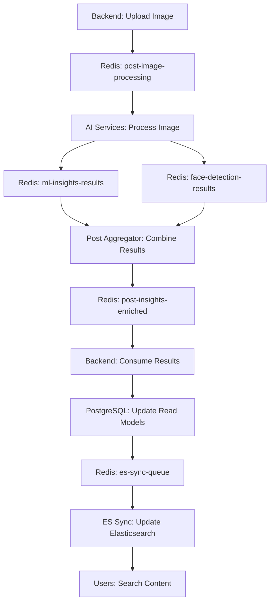

# Backend Integration Walkthrough

**Complete Step-by-Step Guide for Backend Team Integration**

---

## 🎯 Overview

This walkthrough provides the backend team with everything needed to integrate the Kaleidoscope AI services into your Spring Boot application. The integration involves Redis Streams messaging, database schema updates, and Elasticsearch synchronization.

**Estimated Time**: 2-3 weeks  
**Prerequisites**: Spring Boot, PostgreSQL, Redis, Elasticsearch knowledge

---

## 📋 Prerequisites Checklist

### Required Knowledge
- [ ] Spring Boot 2.7+ (JPA, Redis, Async)
- [ ] PostgreSQL with pgvector extension
- [ ] Redis Streams basics
- [ ] Elasticsearch 8.x basics
- [ ] Docker (for testing)

### Required Software
- [ ] Java 17+
- [ ] Maven 3.6+
- [ ] PostgreSQL 14+ with pgvector
- [ ] Redis 6.2+
- [ ] Elasticsearch 8.10.2
- [ ] Docker Desktop

### Development Environment
- [ ] IDE (IntelliJ IDEA recommended)
- [ ] Postman (for API testing)
- [ ] Database client (pgAdmin, DBeaver, etc.)

---

## 🏗️ Integration Architecture

### High-Level Flow

```
Backend Uploads Image
    ↓
Publishes to: post-image-processing
    ↓
AI Services Process (5 services in parallel)
    ↓
Publishes to: ml-insights-results + face-detection-results
    ↓
Post Aggregator Combines Results
    ↓
Publishes to: post-insights-enriched
    ↓
Backend Consumes Enriched Results
    ↓
Updates PostgreSQL Read Models
    ↓
Publishes to: es-sync-queue
    ↓
ES Sync Updates Elasticsearch
    ↓
Users Can Search!
```

### Message Flow Diagram



---

## 📊 Database Schema Integration

### 1. Create Read Model Tables

Execute the SQL script to create 7 read model tables:

```sql
-- Run this script in your PostgreSQL database
-- File: docs/backend-integration/DATABASE_SCHEMA.md

-- 1. Media Search Table
CREATE TABLE media_search_read_model (
    id UUID PRIMARY KEY,
    post_id UUID NOT NULL,
    media_id UUID NOT NULL,
    user_id UUID NOT NULL,
    caption TEXT,
    tags TEXT[],
    scenes TEXT[],
    is_safe BOOLEAN NOT NULL DEFAULT true,
    confidence_score FLOAT,
    face_count INTEGER DEFAULT 0,
    created_at TIMESTAMP WITH TIME ZONE DEFAULT NOW(),
    updated_at TIMESTAMP WITH TIME ZONE DEFAULT NOW()
);

-- 2. Post Search Table
CREATE TABLE post_search_read_model (
    id UUID PRIMARY KEY,
    post_id UUID NOT NULL,
    user_id UUID NOT NULL,
    aggregated_tags TEXT[],
    event_type VARCHAR(100),
    total_media_count INTEGER DEFAULT 0,
    total_face_count INTEGER DEFAULT 0,
    is_safe BOOLEAN NOT NULL DEFAULT true,
    created_at TIMESTAMP WITH TIME ZONE DEFAULT NOW(),
    updated_at TIMESTAMP WITH TIME ZONE DEFAULT NOW()
);

-- 3. User Search Table
CREATE TABLE user_search_read_model (
    id UUID PRIMARY KEY,
    user_id UUID NOT NULL,
    username VARCHAR(255) NOT NULL,
    display_name VARCHAR(255),
    department VARCHAR(100),
    interests TEXT[],
    created_at TIMESTAMP WITH TIME ZONE DEFAULT NOW(),
    updated_at TIMESTAMP WITH TIME ZONE DEFAULT NOW()
);

-- 4. Face Search Table
CREATE TABLE face_search_read_model (
    id UUID PRIMARY KEY,
    media_id UUID NOT NULL,
    post_id UUID NOT NULL,
    user_id UUID NOT NULL,
    face_embedding VECTOR(1024),
    bounding_box JSONB,
    confidence FLOAT,
    created_at TIMESTAMP WITH TIME ZONE DEFAULT NOW(),
    updated_at TIMESTAMP WITH TIME ZONE DEFAULT NOW()
);

-- 5. Recommendations KNN Table
CREATE TABLE recommendations_knn_read_model (
    id UUID PRIMARY KEY,
    media_id UUID NOT NULL,
    post_id UUID NOT NULL,
    user_id UUID NOT NULL,
    image_embedding VECTOR(512),
    tags TEXT[],
    created_at TIMESTAMP WITH TIME ZONE DEFAULT NOW(),
    updated_at TIMESTAMP WITH TIME ZONE DEFAULT NOW()
);

-- 6. Feed Personalized Table
CREATE TABLE feed_personalized_read_model (
    id UUID PRIMARY KEY,
    post_id UUID NOT NULL,
    user_id UUID NOT NULL,
    score FLOAT DEFAULT 0.0,
    reason TEXT,
    created_at TIMESTAMP WITH TIME ZONE DEFAULT NOW(),
    updated_at TIMESTAMP WITH TIME ZONE DEFAULT NOW()
);

-- 7. Known Faces Table
CREATE TABLE known_faces_read_model (
    id UUID PRIMARY KEY,
    user_id UUID NOT NULL,
    face_embedding VECTOR(1024),
    name VARCHAR(255) NOT NULL,
    created_at TIMESTAMP WITH TIME ZONE DEFAULT NOW(),
    updated_at TIMESTAMP WITH TIME ZONE DEFAULT NOW()
);

-- Create indexes for performance
CREATE INDEX idx_media_search_post_id ON media_search_read_model(post_id);
CREATE INDEX idx_media_search_user_id ON media_search_read_model(user_id);
CREATE INDEX idx_media_search_tags ON media_search_read_model USING GIN(tags);
CREATE INDEX idx_media_search_scenes ON media_search_read_model USING GIN(scenes);

CREATE INDEX idx_post_search_user_id ON post_search_read_model(user_id);
CREATE INDEX idx_post_search_event_type ON post_search_read_model(event_type);
CREATE INDEX idx_post_search_tags ON post_search_read_model USING GIN(aggregated_tags);

CREATE INDEX idx_user_search_username ON user_search_read_model(username);
CREATE INDEX idx_user_search_department ON user_search_read_model(department);
CREATE INDEX idx_user_search_interests ON user_search_read_model USING GIN(interests);

CREATE INDEX idx_face_search_media_id ON face_search_read_model(media_id);
CREATE INDEX idx_face_search_user_id ON face_search_read_model(user_id);
CREATE INDEX idx_face_search_embedding ON face_search_read_model USING ivfflat (face_embedding vector_cosine_ops);

CREATE INDEX idx_recommendations_media_id ON recommendations_knn_read_model(media_id);
CREATE INDEX idx_recommendations_user_id ON recommendations_knn_read_model(user_id);
CREATE INDEX idx_recommendations_embedding ON recommendations_knn_read_model USING ivfflat (image_embedding vector_cosine_ops);

CREATE INDEX idx_feed_personalized_user_id ON feed_personalized_read_model(user_id);
CREATE INDEX idx_feed_personalized_score ON feed_personalized_read_model(score);

CREATE INDEX idx_known_faces_user_id ON known_faces_read_model(user_id);
CREATE INDEX idx_known_faces_embedding ON known_faces_read_model USING ivfflat (face_embedding vector_cosine_ops);
```

### 2. Update Application Properties

Add Redis and Elasticsearch configuration to your `application.yml`:

```yaml
# application.yml
spring:
  redis:
    host: localhost
    port: 6379
    timeout: 2000ms
    lettuce:
      pool:
        max-active: 8
        max-idle: 8
        min-idle: 0

  elasticsearch:
    uris: http://localhost:9200
    username: elastic
    password: your_elasticsearch_password

  datasource:
    url: jdbc:postgresql://localhost:5432/your_database
    username: your_username
    password: your_password
    driver-class-name: org.postgresql.Driver

  jpa:
    hibernate:
      ddl-auto: validate
    properties:
      hibernate:
        dialect: org.hibernate.dialect.PostgreSQLDialect
        format_sql: true
    show-sql: false

# Custom configuration
kaleidoscope:
  redis:
    streams:
      post-image-processing: post-image-processing
      ml-insights-results: ml-insights-results
      face-detection-results: face-detection-results
      post-insights-enriched: post-insights-enriched
      es-sync-queue: es-sync-queue
  elasticsearch:
    indices:
      media-search: media_search
      post-search: post_search
      user-search: user_search
      face-search: face_search
      recommendations-knn: recommendations_knn
      feed-personalized: feed_personalized
      known-faces: known_faces_index
```

---

## 🔧 Redis Streams Integration

### 1. Add Dependencies

Add to your `pom.xml`:

```xml
<dependencies>
    <!-- Existing dependencies -->
    
    <!-- Redis Streams -->
    <dependency>
        <groupId>org.springframework.boot</groupId>
        <artifactId>spring-boot-starter-data-redis</artifactId>
    </dependency>
    
    <!-- Elasticsearch -->
    <dependency>
        <groupId>org.springframework.boot</groupId>
        <artifactId>spring-boot-starter-data-elasticsearch</artifactId>
    </dependency>
    
    <!-- JSON Processing -->
    <dependency>
        <groupId>com.fasterxml.jackson.core</groupId>
        <artifactId>jackson-databind</artifactId>
    </dependency>
    
    <!-- Vector Support -->
    <dependency>
        <groupId>org.postgresql</groupId>
        <artifactId>postgresql</artifactId>
        <scope>runtime</scope>
    </dependency>
</dependencies>
```

### 2. Create Redis Stream Publisher

```java
// RedisStreamPublisher.java
@Component
@Slf4j
public class RedisStreamPublisher {
    
    @Autowired
    private RedisTemplate<String, Object> redisTemplate;
    
    @Value("${kaleidoscope.redis.streams.post-image-processing}")
    private String postImageProcessingStream;
    
    @Value("${kaleidoscope.redis.streams.es-sync-queue}")
    private String esSyncQueueStream;
    
    public void publishImageProcessingJob(ImageProcessingJob job) {
        try {
            Map<String, Object> message = Map.of(
                "jobId", job.getJobId(),
                "postId", job.getPostId(),
                "mediaId", job.getMediaId(),
                "userId", job.getUserId(),
                "imageUrl", job.getImageUrl(),
                "timestamp", System.currentTimeMillis()
            );
            
            redisTemplate.opsForStream().add(postImageProcessingStream, message);
            log.info("Published image processing job: {}", job.getJobId());
            
        } catch (Exception e) {
            log.error("Failed to publish image processing job: {}", e.getMessage());
            throw new RuntimeException("Failed to publish job", e);
        }
    }
    
    public void publishESSyncMessage(ESSyncMessage message) {
        try {
            Map<String, Object> payload = Map.of(
                "tableName", message.getTableName(),
                "operation", message.getOperation(),
                "recordId", message.getRecordId(),
                "data", message.getData(),
                "timestamp", System.currentTimeMillis()
            );
            
            redisTemplate.opsForStream().add(esSyncQueueStream, payload);
            log.info("Published ES sync message for table: {}", message.getTableName());
            
        } catch (Exception e) {
            log.error("Failed to publish ES sync message: {}", e.getMessage());
            throw new RuntimeException("Failed to publish ES sync", e);
        }
    }
}
```

### 3. Create Redis Stream Consumers

```java
// MLInsightsConsumer.java
@Component
@Slf4j
public class MLInsightsConsumer {
    
    @Autowired
    private MediaSearchReadModelRepository mediaSearchRepo;
    
    @Autowired
    private PostSearchReadModelRepository postSearchRepo;
    
    @Autowired
    private RedisStreamPublisher redisPublisher;
    
    @Value("${kaleidoscope.redis.streams.ml-insights-results}")
    private String mlInsightsResultsStream;
    
    @Value("${kaleidoscope.redis.streams.face-detection-results}")
    private String faceDetectionResultsStream;
    
    @Value("${kaleidoscope.redis.streams.post-insights-enriched}")
    private String postInsightsEnrichedStream;
    
    @StreamListener(target = mlInsightsResultsStream)
    public void handleMLInsights(MLInsightsResult result) {
        try {
            log.info("Received ML insights for media: {}", result.getMediaId());
            
            // Update media search read model
            updateMediaSearchReadModel(result);
            
            // Check if all media in post are processed
            if (isPostComplete(result.getPostId())) {
                // Trigger post aggregation
                triggerPostAggregation(result.getPostId());
            }
            
        } catch (Exception e) {
            log.error("Failed to process ML insights: {}", e.getMessage());
        }
    }
    
    @StreamListener(target = faceDetectionResultsStream)
    public void handleFaceDetection(FaceDetectionResult result) {
        try {
            log.info("Received face detection for media: {}", result.getMediaId());
            
            // Update face search read model
            updateFaceSearchReadModel(result);
            
        } catch (Exception e) {
            log.error("Failed to process face detection: {}", e.getMessage());
        }
    }
    
    @StreamListener(target = postInsightsEnrichedStream)
    public void handlePostInsights(PostInsightsEnriched result) {
        try {
            log.info("Received enriched post insights for post: {}", result.getPostId());
            
            // Update post search read model
            updatePostSearchReadModel(result);
            
            // Trigger ES sync
            triggerESSync(result);
            
        } catch (Exception e) {
            log.error("Failed to process post insights: {}", e.getMessage());
        }
    }
    
    private void updateMediaSearchReadModel(MLInsightsResult result) {
        MediaSearchReadModel model = new MediaSearchReadModel();
        model.setId(UUID.randomUUID());
        model.setPostId(result.getPostId());
        model.setMediaId(result.getMediaId());
        model.setUserId(result.getUserId());
        model.setCaption(result.getCaption());
        model.setTags(result.getTags());
        model.setScenes(result.getScenes());
        model.setIsSafe(result.getIsSafe());
        model.setConfidenceScore(result.getConfidenceScore());
        model.setFaceCount(result.getFaceCount());
        
        mediaSearchRepo.save(model);
    }
    
    private void updateFaceSearchReadModel(FaceDetectionResult result) {
        // Implementation for face search read model
        // Similar to above but for face data
    }
    
    private void updatePostSearchReadModel(PostInsightsEnriched result) {
        PostSearchReadModel model = new PostSearchReadModel();
        model.setId(UUID.randomUUID());
        model.setPostId(result.getPostId());
        model.setUserId(result.getUserId());
        model.setAggregatedTags(result.getAggregatedTags());
        model.setEventType(result.getEventType());
        model.setTotalMediaCount(result.getTotalMediaCount());
        model.setTotalFaceCount(result.getTotalFaceCount());
        model.setIsSafe(result.getIsSafe());
        
        postSearchRepo.save(model);
    }
    
    private boolean isPostComplete(UUID postId) {
        // Check if all media in the post have been processed
        // Implementation depends on your post structure
        return true; // Simplified for example
    }
    
    private void triggerPostAggregation(UUID postId) {
        // Implementation to trigger post aggregation
        // This would typically involve publishing a message
    }
    
    private void triggerESSync(PostInsightsEnriched result) {
        ESSyncMessage message = new ESSyncMessage();
        message.setTableName("post_search_read_model");
        message.setOperation("INSERT");
        message.setRecordId(result.getPostId().toString());
        message.setData(result);
        
        redisPublisher.publishESSyncMessage(message);
    }
}
```

### 4. Create DTOs for Message Handling

```java
// ImageProcessingJob.java
@Data
@NoArgsConstructor
@AllArgsConstructor
public class ImageProcessingJob {
    private String jobId;
    private UUID postId;
    private UUID mediaId;
    private UUID userId;
    private String imageUrl;
    private Long timestamp;
}

// MLInsightsResult.java
@Data
@NoArgsConstructor
@AllArgsConstructor
public class MLInsightsResult {
    private UUID postId;
    private UUID mediaId;
    private UUID userId;
    private String caption;
    private List<String> tags;
    private List<String> scenes;
    private Boolean isSafe;
    private Float confidenceScore;
    private Integer faceCount;
}

// FaceDetectionResult.java
@Data
@NoArgsConstructor
@AllArgsConstructor
public class FaceDetectionResult {
    private UUID postId;
    private UUID mediaId;
    private UUID userId;
    private List<FaceDetection> faces;
}

// FaceDetection.java
@Data
@NoArgsConstructor
@AllArgsConstructor
public class FaceDetection {
    private List<Float> boundingBox;
    private List<Float> embedding;
    private Float confidence;
}

// PostInsightsEnriched.java
@Data
@NoArgsConstructor
@AllArgsConstructor
public class PostInsightsEnriched {
    private UUID postId;
    private UUID userId;
    private List<String> aggregatedTags;
    private String eventType;
    private Integer totalMediaCount;
    private Integer totalFaceCount;
    private Boolean isSafe;
}

// ESSyncMessage.java
@Data
@NoArgsConstructor
@AllArgsConstructor
public class ESSyncMessage {
    private String tableName;
    private String operation;
    private String recordId;
    private Object data;
}
```

---

## 🔍 Elasticsearch Integration

### 1. Create Elasticsearch Documents

```java
// MediaSearchDocument.java
@Document(indexName = "media_search")
@Data
@NoArgsConstructor
@AllArgsConstructor
public class MediaSearchDocument {
    @Id
    private String id;
    
    @Field(type = FieldType.Keyword)
    private String postId;
    
    @Field(type = FieldType.Keyword)
    private String mediaId;
    
    @Field(type = FieldType.Keyword)
    private String userId;
    
    @Field(type = FieldType.Text, analyzer = "standard")
    private String caption;
    
    @Field(type = FieldType.Keyword)
    private List<String> tags;
    
    @Field(type = FieldType.Keyword)
    private List<String> scenes;
    
    @Field(type = FieldType.Boolean)
    private Boolean isSafe;
    
    @Field(type = FieldType.Float)
    private Float confidenceScore;
    
    @Field(type = FieldType.Integer)
    private Integer faceCount;
    
    @Field(type = FieldType.Date)
    private LocalDateTime createdAt;
}

// PostSearchDocument.java
@Document(indexName = "post_search")
@Data
@NoArgsConstructor
@AllArgsConstructor
public class PostSearchDocument {
    @Id
    private String id;
    
    @Field(type = FieldType.Keyword)
    private String postId;
    
    @Field(type = FieldType.Keyword)
    private String userId;
    
    @Field(type = FieldType.Keyword)
    private List<String> aggregatedTags;
    
    @Field(type = FieldType.Keyword)
    private String eventType;
    
    @Field(type = FieldType.Integer)
    private Integer totalMediaCount;
    
    @Field(type = FieldType.Integer)
    private Integer totalFaceCount;
    
    @Field(type = FieldType.Boolean)
    private Boolean isSafe;
    
    @Field(type = FieldType.Date)
    private LocalDateTime createdAt;
}
```

### 2. Create Elasticsearch Repositories

```java
// MediaSearchRepository.java
@Repository
public interface MediaSearchRepository extends ElasticsearchRepository<MediaSearchDocument, String> {
    
    List<MediaSearchDocument> findByUserIdAndIsSafeTrue(String userId);
    
    List<MediaSearchDocument> findByTagsIn(List<String> tags);
    
    List<MediaSearchDocument> findByScenesIn(List<String> scenes);
    
    @Query("{\"bool\": {\"must\": [{\"match\": {\"caption\": \"?0\"}}, {\"term\": {\"isSafe\": true}}]}}")
    List<MediaSearchDocument> searchByCaption(String caption);
    
    @Query("{\"bool\": {\"must\": [{\"terms\": {\"tags\": ?0}}, {\"term\": {\"isSafe\": true}}]}}")
    List<MediaSearchDocument> searchByTags(List<String> tags);
}

// PostSearchRepository.java
@Repository
public interface PostSearchRepository extends ElasticsearchRepository<PostSearchDocument, String> {
    
    List<PostSearchDocument> findByUserIdAndIsSafeTrue(String userId);
    
    List<PostSearchDocument> findByEventType(String eventType);
    
    List<PostSearchDocument> findByAggregatedTagsIn(List<String> tags);
    
    @Query("{\"bool\": {\"must\": [{\"terms\": {\"aggregatedTags\": ?0}}, {\"term\": {\"isSafe\": true}}]}}")
    List<PostSearchDocument> searchByTags(List<String> tags);
}
```

### 3. Create Search Service

```java
// SearchService.java
@Service
@Slf4j
public class SearchService {
    
    @Autowired
    private MediaSearchRepository mediaSearchRepo;
    
    @Autowired
    private PostSearchRepository postSearchRepo;
    
    public List<MediaSearchDocument> searchMedia(String query, List<String> tags, List<String> scenes) {
        BoolQuery.Builder boolQuery = new BoolQuery.Builder();
        
        if (query != null && !query.isEmpty()) {
            boolQuery.must(Query.of(q -> q.match(m -> m.field("caption").query(query))));
        }
        
        if (tags != null && !tags.isEmpty()) {
            boolQuery.must(Query.of(q -> q.terms(t -> t.field("tags").terms(terms -> terms.value(tags.stream().map(FieldValue::of).collect(Collectors.toList()))))));
        }
        
        if (scenes != null && !scenes.isEmpty()) {
            boolQuery.must(Query.of(q -> q.terms(t -> t.field("scenes").terms(terms -> terms.value(scenes.stream().map(FieldValue::of).collect(Collectors.toList()))))));
        }
        
        boolQuery.must(Query.of(q -> q.term(t -> t.field("isSafe").value(true))));
        
        SearchRequest searchRequest = SearchRequest.of(s -> s
            .index("media_search")
            .query(boolQuery.build()._toQuery())
            .size(20)
        );
        
        try {
            SearchResponse<MediaSearchDocument> response = elasticsearchClient.search(searchRequest, MediaSearchDocument.class);
            return response.hits().hits().stream()
                .map(hit -> hit.source())
                .collect(Collectors.toList());
        } catch (IOException e) {
            log.error("Failed to search media: {}", e.getMessage());
            throw new RuntimeException("Search failed", e);
        }
    }
    
    public List<PostSearchDocument> searchPosts(String query, List<String> tags, String eventType) {
        BoolQuery.Builder boolQuery = new BoolQuery.Builder();
        
        if (query != null && !query.isEmpty()) {
            boolQuery.must(Query.of(q -> q.multiMatch(m -> m
                .fields("aggregatedTags", "eventType")
                .query(query)
            )));
        }
        
        if (tags != null && !tags.isEmpty()) {
            boolQuery.must(Query.of(q -> q.terms(t -> t.field("aggregatedTags").terms(terms -> terms.value(tags.stream().map(FieldValue::of).collect(Collectors.toList()))))));
        }
        
        if (eventType != null && !eventType.isEmpty()) {
            boolQuery.must(Query.of(q -> q.term(t -> t.field("eventType").value(eventType))));
        }
        
        boolQuery.must(Query.of(q -> q.term(t -> t.field("isSafe").value(true))));
        
        SearchRequest searchRequest = SearchRequest.of(s -> s
            .index("post_search")
            .query(boolQuery.build()._toQuery())
            .size(20)
        );
        
        try {
            SearchResponse<PostSearchDocument> response = elasticsearchClient.search(searchRequest, PostSearchDocument.class);
            return response.hits().hits().stream()
                .map(hit -> hit.source())
                .collect(Collectors.toList());
        } catch (IOException e) {
            log.error("Failed to search posts: {}", e.getMessage());
            throw new RuntimeException("Search failed", e);
        }
    }
}
```

---

## 🚀 Integration Steps

### Step 1: Database Setup (Day 1)

1. **Create Read Model Tables**
   ```bash
   # Connect to your PostgreSQL database
   psql -U your_username -d your_database
   
   # Run the SQL script
   \i docs/backend-integration/DATABASE_SCHEMA.md
   ```

2. **Verify Tables Created**
   ```sql
   \dt *read_model
   ```

3. **Test pgvector Extension**
   ```sql
   SELECT * FROM pg_extension WHERE extname = 'vector';
   ```

### Step 2: Redis Streams Setup (Day 2-3)

1. **Add Dependencies to pom.xml**
2. **Create Redis Configuration**
3. **Implement Message Publishers**
4. **Test Publishing Messages**

### Step 3: AI Services Integration (Day 4-5)

1. **Implement Image Processing Job Publisher**
2. **Create Message Consumers**
3. **Test End-to-End Flow**

### Step 4: Elasticsearch Integration (Day 6-7)

1. **Create Elasticsearch Documents**
2. **Implement Search Service**
3. **Test Search Functionality**

### Step 5: Testing & Validation (Day 8-10)

1. **Unit Tests for Each Component**
2. **Integration Tests**
3. **End-to-End Testing**

---

## 🧪 Testing Your Integration

### 1. Test Image Processing Flow

```java
@Test
public void testImageProcessingFlow() {
    // Create test image processing job
    ImageProcessingJob job = new ImageProcessingJob();
    job.setJobId("test-job-1");
    job.setPostId(UUID.randomUUID());
    job.setMediaId(UUID.randomUUID());
    job.setUserId(UUID.randomUUID());
    job.setImageUrl("https://example.com/test-image.jpg");
    
    // Publish job
    redisStreamPublisher.publishImageProcessingJob(job);
    
    // Wait for processing
    Thread.sleep(30000); // 30 seconds
    
    // Verify results in database
    List<MediaSearchReadModel> results = mediaSearchRepo.findByPostId(job.getPostId());
    assertThat(results).isNotEmpty();
}
```

### 2. Test Search Functionality

```java
@Test
public void testSearchFunctionality() {
    // Search for media
    List<MediaSearchDocument> results = searchService.searchMedia("beach", null, null);
    assertThat(results).isNotEmpty();
    
    // Search for posts
    List<PostSearchDocument> postResults = searchService.searchPosts("team outing", null, null);
    assertThat(postResults).isNotEmpty();
}
```

### 3. Test Redis Streams

```bash
# Check Redis streams
redis-cli XREAD STREAMS post-image-processing 0

# Check message count
redis-cli XLEN post-image-processing
```

---

## 🔧 Troubleshooting

### Common Issues

1. **Redis Connection Failed**
   - Check Redis is running: `redis-cli ping`
   - Verify connection settings in application.yml

2. **Elasticsearch Connection Failed**
   - Check Elasticsearch is running: `curl http://localhost:9200`
   - Verify credentials and URL

3. **Database Connection Failed**
   - Check PostgreSQL is running
   - Verify pgvector extension is installed
   - Check connection string

4. **Messages Not Processing**
   - Check Redis streams exist
   - Verify consumer configuration
   - Check service logs

### Debug Commands

```bash
# Check Redis streams
redis-cli XREAD STREAMS post-image-processing 0

# Check Elasticsearch indices
curl http://localhost:9200/_cat/indices?v

# Check database tables
psql -U your_username -d your_database -c "\dt *read_model"

# Check service logs
docker compose logs -f [service_name]
```

---

## 📈 Performance Optimization

### Redis Streams
- Use connection pooling
- Implement retry logic
- Monitor memory usage

### Elasticsearch
- Tune index settings
- Use bulk operations
- Monitor query performance

### Database
- Create appropriate indexes
- Use connection pooling
- Monitor query performance

---

## 🎯 Success Criteria

### Integration Complete When:
- [ ] All 7 read model tables created
- [ ] Redis Streams publishing/consuming working
- [ ] AI services processing images
- [ ] Elasticsearch indexing data
- [ ] Search functionality working
- [ ] All tests passing

### Performance Targets:
- [ ] Image processing: < 60 seconds
- [ ] Search response: < 100ms
- [ ] Database queries: < 50ms
- [ ] Redis operations: < 10ms

---

## 📞 Support

### Documentation References
- [Database Schema](DATABASE_SCHEMA.md)
- [Message Formats](MESSAGE_FORMATS.md)
- [Code Examples](CODE_EXAMPLES.md)
- [Backend Requirements](BACKEND_REQUIREMENTS.md)

### Getting Help
1. Check troubleshooting section above
2. Review service logs
3. Test individual components
4. Consult architecture documentation

---

**Ready to integrate? Start with Step 1 and work through each phase systematically!** 🚀
