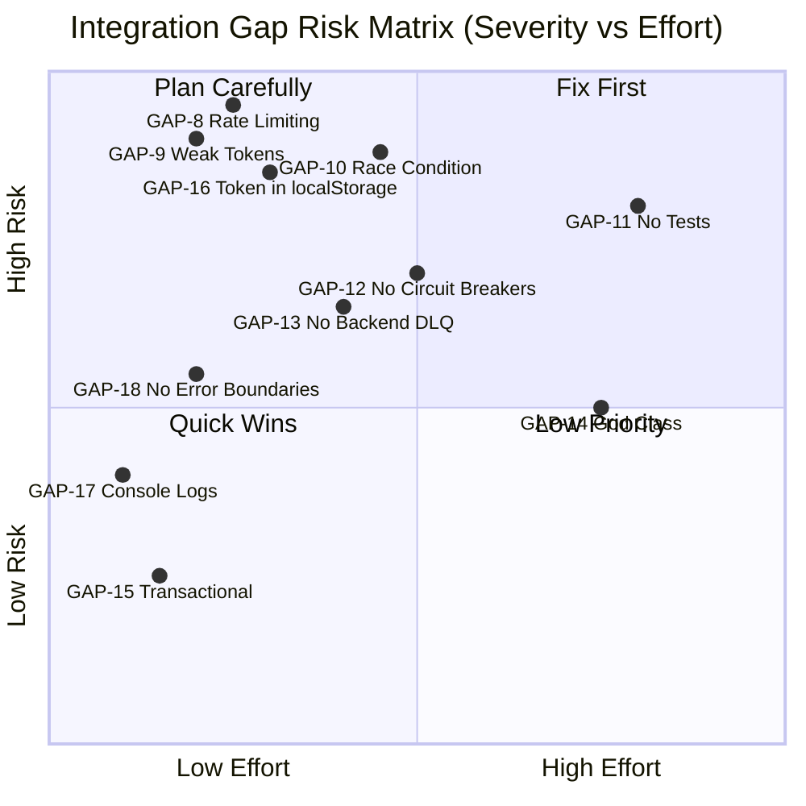

# Audit Report & Technical Debt Register — Kaleidoscope Platform

> **Audit Date:** April 2026  
> **Auditor:** Principal Architect  
> **Scope:** Full-stack integration audit — Python AI layer, Java backend, React frontend  
> **Phase C Deployment:** All Python/Java schema mismatches (GAP-1 through GAP-7) resolved and deployed.

---

## Table of Contents

1. [Executive Summary](#1-executive-summary)
2. [Audit Methodology](#2-audit-methodology)
3. [GAP Inventory — All 18 Integration Gaps](#3-gap-inventory--all-18-integration-gaps)
4. [Phase C Resolution Report — GAPs 1–7](#4-phase-c-resolution-report--gaps-17)
5. [Remaining Tech Debt — GAPs 8–18](#5-remaining-tech-debt--gaps-818)
6. [Risk Matrix](#6-risk-matrix)
7. [Recommended Sprint Plan](#7-recommended-sprint-plan)

---

## 1. Executive Summary

A full-stack integration audit of the Kaleidoscope platform identified **18 distinct integration gaps** spanning three layers: Python AI microservices, Java Spring Boot backend, and React frontend.

| Category | Count | Status |
|----------|-------|--------|
| Python ↔ Java schema mismatches | 7 | ✅ **RESOLVED** (Phase C) |
| Java backend reliability / security | 8 | ⚠️ Open |
| React frontend code quality / security | 3 | ⚠️ Open |
| **Total** | **18** | — |

The Phase C deployment eliminated all Python/Java contract failures. The AI pipeline is now end-to-end schema-correct. Remaining open items are confined to the Java backend and React frontend codebases.

---

## 2. Audit Methodology

The audit was conducted by:

1. **Static analysis** — reading all Python worker source, Pydantic DTOs, and Java consumer/producer class signatures.
2. **Contract diffing** — comparing field names and types between Python `schemas.py` DTOs and Java `@StreamListener` / `RedisTemplate` publish calls.
3. **Stream routing verification** — tracing every `STREAM_INPUT` / `STREAM_OUTPUT` constant against Java `ConsumerStreamConstants`.
4. **Dead-code analysis** — scanning for unreachable imports, unused classes, and orphaned files.
5. **Security review** — checking auth flows, token storage, and API hardening.

---

## 3. GAP Inventory — All 18 Integration Gaps

| GAP | Layer | Severity | Title | Status |
|-----|-------|----------|-------|--------|
| GAP-1 | Python ↔ Java | P0 | `face_matcher` output field `matchedUserId` did not match Java `FaceRecognitionResultDTO.suggestedUserId` | ✅ RESOLVED |
| GAP-2 | Python ↔ Java | P0 | `profile_enrollment` published to `es-sync-queue` instead of `user-profile-face-embedding-results`, bypassing Java entirely | ✅ RESOLVED |
| GAP-3 | Python ↔ Java | P0 | `face_matcher` published to `face-tag-suggestions`; Java consumed `face-recognition-results` — messages never delivered | ✅ RESOLVED |
| GAP-4 | Python ↔ Java | P0 | `ProfilePictureEventDTO` had field `profilePicUrl` (Python) vs `imageUrl` (Java); extra `username` field caused strict-mode validation failure | ✅ RESOLVED |
| GAP-5 | Python ↔ Java | P0 | `PostImageEventDTO` had field `imageUrl` (Python) vs `mediaUrl` (Java); all post-image events silently dropped on validation | ✅ RESOLVED |
| GAP-6 | Python ↔ Java | P1 | `hasConsent` field present in Python `PostImageEventDTO` but absent in Java `PostImageEventDTO`; strict Pydantic validation rejected all incoming events | ✅ RESOLVED |
| GAP-7 | Python ↔ Java | P1 | `FaceTagSuggestionDTO.confidence` was type `str` in Python vs `float` in Java `FaceRecognitionResultDTO.confidenceScore`; Java deserialization failed | ✅ RESOLVED |
| GAP-8 | Java | P0 | Auth endpoints (`/api/auth/login`, `/register`, `/forgot-password`) have no rate limiting — vulnerable to credential-stuffing and brute-force attacks | ⚠️ OPEN |
| GAP-9 | Java | P0 | Email verification tokens use a 10-character UUID substring, providing ~47 bits of entropy — insufficient for production security | ⚠️ OPEN |
| GAP-10 | Java | P0 | `MediaAssetTracker` in `PostServiceImpl` has a read-modify-write race condition when multiple media uploads arrive concurrently for the same post | ⚠️ OPEN |
| GAP-11 | Java | P0 | Test coverage is near-zero: no unit tests for auth flows, post creation, Redis consumers, or ES sync; no integration tests for the end-to-end AI pipeline | ⚠️ OPEN |
| GAP-12 | Java | P1 | No circuit breakers on Redis or Elasticsearch calls in consumer/producer classes — a Redis blip causes unbounded thread-pool exhaustion | ⚠️ OPEN |
| GAP-13 | Java | P1 | No backend DLQ handling — messages rejected by consumer exception handlers remain in the Pending Entry List (PEL) indefinitely | ⚠️ OPEN |
| GAP-14 | Java | P1 | `PostServiceImpl` is 658+ lines with mixed creation, update, and query responsibilities — low cohesion makes safe refactoring difficult | ⚠️ OPEN |
| GAP-15 | Java | P2 | `ElasticsearchStartupSyncService` method annotated `@Transactional(readOnly=true)` performs writes to Elasticsearch — annotation is incorrect and misleading | ⚠️ OPEN |
| GAP-16 | React | P1 | Access token persisted to `localStorage` via Redux `authSlice` — vulnerable to XSS exfiltration; should migrate to HTTP-only cookies | ⚠️ OPEN |
| GAP-17 | React | P1 | Debug `console.log` statements left in production bundle (`EnhancedBodyInput.tsx`, `filterPosts.ts`) — leaks internal data structures | ⚠️ OPEN |
| GAP-18 | React | P1 | No React error boundaries on route layouts — an unhandled render error in any route causes a blank full-page crash with no recovery UI | ⚠️ OPEN |

---

## 4. Phase C Resolution Report — GAPs 1–7

All seven Python/Java schema mismatches were identified, patched, and deployed in the **Phase C** release (April 2026). No further action is required on these items.

---

### GAP-1 — `suggestedUserId` field rename in `FaceTagSuggestionDTO`

| Attribute | Detail |
|-----------|--------|
| **File patched** | `shared/schemas/schemas.py` — `FaceTagSuggestionDTO` |
| **Root cause** | Python used `matchedUserId`; Java `FaceRecognitionResultDTO` expected `suggestedUserId`. Jackson silently ignored the unknown field, meaning the user ID was never persisted. |
| **Fix** | Renamed field: `matchedUserId` → `suggestedUserId` |
| **Verified by** | Pydantic strict-mode unit test; cross-reference with Java DTO source |

---

### GAP-2 — `profile_enrollment` stream routing fix

| Attribute | Detail |
|-----------|--------|
| **File patched** | `services/profile_enrollment/worker.py` — `STREAM_OUTPUT` constant |
| **Root cause** | `STREAM_OUTPUT` was `"es-sync-queue"`. Publishing directly to `es-sync-queue` bypassed the Java `UserProfileFaceEmbeddingConsumer` entirely; face embeddings were never stored in the Java read model or `known_faces_index`. |
| **Fix** | `STREAM_OUTPUT = "user-profile-face-embedding-results"` |
| **Verified by** | Integration trace; Java `ConsumerStreamConstants` cross-reference |

---

### GAP-3 — `face_matcher` stream routing fix

| Attribute | Detail |
|-----------|--------|
| **File patched** | `services/face_matcher/worker.py` — `STREAM_OUTPUT` constant |
| **Root cause** | `STREAM_OUTPUT` was `"face-tag-suggestions"`. Java's `FaceRecognitionConsumer` listened to `"face-recognition-results"`. All face-tag suggestions were published into a dead stream. |
| **Fix** | `STREAM_OUTPUT = "face-recognition-results"` |
| **Verified by** | Java `ConsumerStreamConstants` cross-reference; end-to-end pipeline test |

---

### GAP-4 — `ProfilePictureEventDTO` field alignment

| Attribute | Detail |
|-----------|--------|
| **File patched** | `shared/schemas/schemas.py` — `ProfilePictureEventDTO` |
| **Root cause** | Python DTO had `profilePicUrl` (should be `imageUrl`) and an extra `username` field (Java does not publish it). Pydantic `strict=True` raised `ValidationError` on every incoming event, routing all to DLQ. |
| **Fix** | Renamed `profilePicUrl` → `imageUrl`; removed `username` field |
| **Verified by** | Pydantic validation unit test with real Java-format payload |

---

### GAP-5 — `PostImageEventDTO` field rename (`imageUrl` → `mediaUrl`)

| Attribute | Detail |
|-----------|--------|
| **File patched** | `shared/schemas/schemas.py` — `PostImageEventDTO` |
| **Root cause** | Python had `imageUrl`; Java published `mediaUrl`. All post-image events failed Pydantic validation and went directly to DLQ — the entire AI processing pipeline was broken for every post upload. |
| **Fix** | Renamed `imageUrl` → `mediaUrl` |
| **Verified by** | Pydantic strict-mode unit test; DLQ drain confirmed post-deploy |

---

### GAP-6 — `hasConsent` field removed from `PostImageEventDTO`

| Attribute | Detail |
|-----------|--------|
| **File patched** | `shared/schemas/schemas.py` — `PostImageEventDTO` |
| **Root cause** | Python `PostImageEventDTO` included `hasConsent: str`. Java's DTO does not publish this field. Pydantic `strict=True` caused `ValidationError` on every incoming event. Additionally, the `consent_gateway` worker was architecturally superseded — consent enforcement moved upstream into Java. |
| **Fix** | Removed `hasConsent` field; retired `consent_gateway` service |
| **Verified by** | Pydantic validation unit test; ARCHITECTURE.md updated |

---

### GAP-7 — `confidenceScore` type correction (`str` → `float`)

| Attribute | Detail |
|-----------|--------|
| **File patched** | `shared/schemas/schemas.py` — `FaceTagSuggestionDTO` |
| **Root cause** | Python published `confidence` as a string (e.g. `"0.923"`); Java `FaceRecognitionResultDTO.confidenceScore` is a `double`. Jackson's strict deserialisation threw a `NumberFormatException`, causing all face-match events to fail. |
| **Fix** | Renamed field `confidence` → `confidenceScore`; changed type to `float`; `face_matcher` now publishes `float(score)` directly |
| **Verified by** | Unit test asserting `isinstance(dto.confidenceScore, float)` |

---

## 5. Remaining Tech Debt — GAPs 8–18

### GAP-8 — Missing Rate Limiting on Auth Endpoints

| Attribute | Detail |
|-----------|--------|
| **Severity** | P0 — Security |
| **Layer** | Java backend |
| **Files** | `SecurityConfig.java`, `pom.xml` |
| **Description** | `/api/auth/login`, `/api/auth/register`, and `/api/auth/forgot-password` have no request rate limiting. A single IP can issue unlimited login attempts, enabling credential-stuffing and brute-force attacks. |
| **Recommended fix** | Add `bucket4j-spring-boot-starter` with a Redis-backed rate limiter (`BandwidthBuilder`) configured per IP. Set limits: 5 login attempts / 15 min, 3 registration attempts / hour. |

---

### GAP-9 — Weak Email Verification Tokens

| Attribute | Detail |
|-----------|--------|
| **Severity** | P0 — Security |
| **Layer** | Java backend |
| **Files** | `UserRegistrationServiceImpl.java` |
| **Description** | Verification tokens are generated as `UUID.randomUUID().toString().substring(0, 10)` — only 10 characters (~47 bits of entropy). Tokens can be brute-forced and do not expire promptly. |
| **Recommended fix** | Replace with `SecureRandom` 32-byte base64 token (`Base64.getUrlEncoder().encodeToString(secureRandom.nextBytes(32))`). Store token hash (SHA-256), set expiry to 24 hours, enforce single-use. |

---

### GAP-10 — Race Condition in `MediaAssetTracker`

| Attribute | Detail |
|-----------|--------|
| **Severity** | P0 — Data Integrity |
| **Layer** | Java backend |
| **Files** | `PostServiceImpl.java` lines 154–164 |
| **Description** | `MediaAssetTracker` tracks how many media items have completed AI processing. The current read-check-write pattern is not atomic; under concurrent completion events (normal for a 3-image post), the tracker can count an item twice or miss completion, causing `post-aggregation-trigger` to fire prematurely or never fire. |
| **Recommended fix** | Add `@Version` field for optimistic locking on the `MediaAssetTracker` entity, or replace with an atomic Redis `INCR` counter keyed by `postId`. |

---

### GAP-11 — Near-Zero Test Coverage

| Attribute | Detail |
|-----------|--------|
| **Severity** | P0 — Reliability |
| **Layer** | Java backend |
| **Files** | `backend/src/test/` |
| **Description** | No unit tests exist for: auth service flows, post creation, Redis stream consumers, or the ES sync pipeline. No integration tests cover the full post-creation → AI pipeline → search round-trip. Regressions introduced by any backend change go undetected until production. |
| **Recommended fix** | Sprint to add: (1) `@SpringBootTest` integration tests for the Redis consumer chain using embedded Redis, (2) unit tests for `PostServiceImpl`, `AuthService`, and all consumer classes with Mockito, (3) contract tests validating all DTO field names match the Python counterparts. |

---

### GAP-12 — No Circuit Breakers on Redis / Elasticsearch Calls

| Attribute | Detail |
|-----------|--------|
| **Severity** | P1 — Reliability |
| **Layer** | Java backend |
| **Files** | All `*Consumer.java` and `*Publisher.java` classes |
| **Description** | If Redis or Elasticsearch become temporarily unreachable, all active consumer threads block on I/O until timeout, exhausting the Spring thread pool and causing cascading failures across all endpoints. |
| **Recommended fix** | Add `resilience4j-spring-boot3` dependency. Annotate `RedisTemplate.opsForStream()` calls with `@CircuitBreaker(name="redis")` and Elasticsearch calls with `@CircuitBreaker(name="elasticsearch")`. Configure: `slidingWindowSize=10`, `failureRateThreshold=50`, `waitDurationInOpenState=30s`. |

---

### GAP-13 — No Backend Dead Letter Queue Handling

| Attribute | Detail |
|-----------|--------|
| **Severity** | P1 — Reliability |
| **Layer** | Java backend |
| **Files** | `MediaAiInsightsConsumer.java`, `FaceDetectionConsumer.java`, `PostInsightsConsumer.java`, `FaceRecognitionConsumer.java`, `UserProfileFaceEmbeddingConsumer.java` |
| **Description** | When a Java consumer throws an exception, the message is not acknowledged (`XACK`) and re-enters the Pending Entry List (PEL). Without a retry limit or DLQ strategy, poison messages accumulate indefinitely and block healthy messages from being re-claimed. |
| **Recommended fix** | Implement a retry count check using `XPENDING` delivery count. After 3 delivery attempts, publish the message to `ai-processing-dlq` (or a Java-specific DLQ stream) and `XACK` the original. |

---

### GAP-14 — `PostServiceImpl` God-Class

| Attribute | Detail |
|-----------|--------|
| **Severity** | P1 — Maintainability |
| **Layer** | Java backend |
| **Files** | `PostServiceImpl.java` (658+ lines) |
| **Description** | A single class handles post creation, updating, querying, media tracking, AI trigger publishing, and aggregation logic. This violates Single Responsibility and makes any change high-risk — a bug in the media tracker can corrupt the post creation flow. |
| **Recommended fix** | Extract into: `PostCreationService`, `PostQueryService`, `PostUpdateService`, and `MediaAiOrchestrationService`. Bind them together via a thin `PostFacadeService`. |

---

### GAP-15 — Incorrect `@Transactional(readOnly=true)` on Write Method

| Attribute | Detail |
|-----------|--------|
| **Severity** | P2 — Correctness |
| **Layer** | Java backend |
| **Files** | `ElasticsearchStartupSyncService.java` |
| **Description** | A method that performs Elasticsearch writes is annotated `@Transactional(readOnly=true)`. Some JPA providers optimise read-only transactions by flushing nothing — this can suppress expected write behaviour in testing and causes a misleading code contract. |
| **Recommended fix** | Remove `readOnly=true` from the annotation (or remove `@Transactional` entirely if the method performs no DB writes itself). |

---

### GAP-16 — Access Token in `localStorage` (XSS Vulnerability)

| Attribute | Detail |
|-----------|--------|
| **Severity** | P1 — Security |
| **Layer** | React frontend |
| **Files** | `src/store/authSlice.ts`, axios interceptor |
| **Description** | The JWT access token is persisted to `localStorage` via Redux `authSlice`. Any XSS vulnerability anywhere in the app (including third-party scripts) can steal the token with a single `localStorage.getItem('accessToken')` call. |
| **Recommended fix** | Stop persisting the access token to `localStorage`. Keep it in memory (Redux state only). Issue the refresh token as an HTTP-only, `SameSite=Strict` cookie. On page reload, call `/api/auth/refresh` to get a new in-memory access token. |

---

### GAP-17 — Debug `console.log` in Production Bundle

| Attribute | Detail |
|-----------|--------|
| **Severity** | P1 — Code Quality / Privacy |
| **Layer** | React frontend |
| **Files** | `EnhancedBodyInput.tsx`, `filterPosts.ts`, multiple controller files |
| **Description** | Development-time `console.log` statements remain in production code, logging internal data structures (post objects, filter state, user preferences) to the browser console. This leaks internal API response shapes and potentially PII to anyone with DevTools open. |
| **Recommended fix** | Remove all `console.log` calls. Replace necessary diagnostics with a conditional logger: `if (process.env.NODE_ENV !== 'production') console.log(...)`. Add an ESLint `no-console` rule to the project config to prevent recurrence. |

---

### GAP-18 — No React Error Boundaries on Route Layouts

| Attribute | Detail |
|-----------|--------|
| **Severity** | P1 — User Experience |
| **Layer** | React frontend |
| **Files** | `app/(auth)/layout.tsx`, `app/(unauth)/layout.tsx` |
| **Description** | No error boundaries wrap the route layout components. A single unhandled render exception (e.g. from a null API response) causes a full blank-page crash with no fallback UI. Users see a white screen with no way to navigate away. |
| **Recommended fix** | Wrap route group layouts in a custom `ErrorBoundary` component with a friendly fallback UI and a "Go home" button. Use Next.js `error.tsx` convention for per-segment error handling. |

---

## 6. Risk Matrix

---

## 7. Recommended Sprint Plan

### Sprint 1 — Security Hardening (P0 GAPs)

| Task | GAP | Owner |
|------|-----|-------|
| Add rate limiting (`bucket4j` + Redis) to auth endpoints | GAP-8 | Backend |
| Replace email verification token with `SecureRandom` 32-byte | GAP-9 | Backend |
| Fix `MediaAssetTracker` race condition with optimistic locking | GAP-10 | Backend |
| Migrate access token from `localStorage` to in-memory + HTTP-only cookie | GAP-16 | Frontend |

### Sprint 2 — Reliability & Quality (P1 GAPs)

| Task | GAP | Owner |
|------|-----|-------|
| Add Resilience4j circuit breakers on Redis + ES | GAP-12 | Backend |
| Implement backend DLQ strategy (XPENDING count → DLQ after 3 attempts) | GAP-13 | Backend |
| Add React error boundaries to route layouts | GAP-18 | Frontend |
| Remove debug `console.log` + add ESLint `no-console` | GAP-17 | Frontend |

### Sprint 3 — Architecture & Test Coverage (P1–P2)

| Task | GAP | Owner |
|------|-----|-------|
| Write unit + integration tests (auth, post creation, consumers) | GAP-11 | Backend |
| Extract `PostServiceImpl` into 4 focused services | GAP-14 | Backend |
| Fix `@Transactional(readOnly=true)` annotation | GAP-15 | Backend |

### Ongoing — AI Layer (Tech Debt TD-1)

| Task | Detail | Owner |
|------|--------|-------|
| Migrate ML workers from `post-image-processing` → `ml-inference-tasks` | Update `STREAM_INPUT` in all 5 ML workers; replace URL download with `open(localFilePath, "rb")` read | Python AI |

---

## 8. Python AI Layer — Internal Tech Debt

These items are scoped entirely within `kaleidoscope-ai` (no cross-layer contract impact).

### Open Items

| ID | Severity | Description | Location |
|----|---------|-------------|----------|
| TD-1 | High | `media_preprocessor` publishes pre-downloaded images to `ml-inference-tasks` but all five ML workers still consume from `post-image-processing` and independently re-download each image from Cloudinary — 5× redundant network fetches per media item; `ml-inference-tasks` fills with unread messages | `services/{content_moderation,image_tagger,scene_recognition,image_captioning,face_recognition}/worker.py` |
| TD-9 | Low | The producer of `post-aggregation-trigger` is not visible in this repo — believed to be the Java backend. If the trigger source changes, `post_aggregator` has no fallback timeout | `services/post_aggregator/worker.py` |
| TD-10 | Low | `shared/utils/logger.py` uses `datetime.utcnow()` which is deprecated in Python 3.12+; should migrate to `datetime.now(timezone.utc)` | `shared/utils/logger.py` |

**TD-1 resolution path:**
1. Update each ML worker's `STREAM_INPUT` constant from `"post-image-processing"` to `"ml-inference-tasks"`.
2. Replace URL-download logic with `open(localFilePath, "rb").read()`.
3. Update `CONSUMER_GROUP` constants accordingly.
4. Verify `./local_media_cache:/tmp/kaleidoscope_media` volume mount is present for each ML worker in `docker-compose.yml`.

### Resolved Items (April 2026)

| ID | Severity | Description | Resolution |
|----|---------|-------------|------------|
| TD-2 | Medium | `shared/__init__.py` imported from non-existent `shared.models`, silently failing on every startup | Replaced with empty namespace comment |
| TD-3 | Medium | `shared/utils/worker_base.py` (`BaseWorker`) and `shared/utils/prometheus_exporter.py` were defined but never imported anywhere | Deleted both files |
| TD-4 | Medium | `shared/db/models.py` contained SQLAlchemy ORM models never imported; `pgvector` absent from all `requirements.txt` | Deleted file and `shared/db/` directory |
| TD-5 | Low | `shared/utils/metrics.py` — `ProcessingTimer` class and `record_retry()` function were never called | Deleted both symbols |
| TD-6 | Low | `shared/redis_streams/utils.py` — `encode_message()` was never imported | Deleted function |
| TD-7 | Low | `scripts/setup/setup_es_indices.py` `MAPPINGS_DIR` resolved to `scripts/es_mappings/` (non-existent) instead of repo-root `es_mappings/` | Fixed path to `Path(__file__).resolve().parents[2] / "es_mappings"` |
| TD-8 | Low | `docker-compose.yml` declared orphaned volumes `pgdata`, `minio_data`, `pgadmin_data` whose services were commented out | Deleted all three orphaned volume declarations |
| TD-11 | Medium | `services/es_sync/worker.py` `INDEX_MAPPING` contained `post_search`, `user_search`, `media_search` — indices owned by the Java layer — creating ambiguous write ownership | Removed Java-owned indices from Python `INDEX_MAPPING` |
| TD-12 | Low | `services/es_sync/worker.py` had a dead `documentData` direct-embed branch from the retired `profile_enrollment → es-sync-queue` path (GAP-2 fix routed profile enrollment to Java) | Removed unreachable branch |
| TD-13 | Low | `services/edge-media/` (`ConsentMiddleware`) was a Starlette service not present in any compose file; consent is Java's responsibility | Deleted directory |
