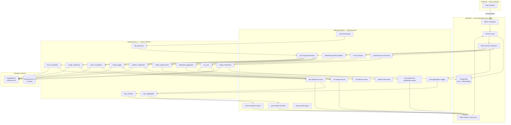

# System Architecture — Kaleidoscope Platform

> **Edition:** Phase C (April 2026)  
> **Scope:** Full-stack platform — React Frontend → Java Spring Boot → Redis Streams → Python AI Workers → Elasticsearch / PostgreSQL  
> **Status:** Reflects all Phase C schema-alignment patches.

---

## Table of Contents

1. [Full-Stack Macro Diagram](#1-full-stack-macro-diagram)
2. [Technology Stack by Layer](#2-technology-stack-by-layer)
3. [Python Microservice Topology](#3-python-microservice-topology)
4. [Active Redis Stream Inventory](#4-active-redis-stream-inventory)
5. [Elasticsearch Index Inventory](#5-elasticsearch-index-inventory)
6. [Infrastructure Services](#6-infrastructure-services)
7. [Shared Library Overview](#7-shared-library-overview)
8. [Health & Observability](#8-health--observability)

---

## 1. Full-Stack Macro Diagram



---

## 2. Technology Stack by Layer

### Frontend

| Concern | Technology |
|---------|-----------|
| Framework | Next.js 14 (React 18, App Router) |
| Language | TypeScript |
| State Management | Redux Toolkit |
| HTTP Client | Axios with interceptors |
| Styling | Tailwind CSS |
| Media Upload | Cloudinary direct upload |

### Backend (Java — read-only from this repo)

| Concern | Technology |
|---------|-----------|
| Framework | Spring Boot 3.x |
| Language | Java 21 |
| ORM | Spring Data JPA (Hibernate) |
| Database | PostgreSQL 15 |
| Caching / Messaging | Spring Data Redis (RedisTemplate, `XADD` / `XREADGROUP`) |
| Search | Spring Data Elasticsearch |
| Media CDN | Cloudinary |
| Port | 8080 |

### AI Microservices Layer (`kaleidoscope-ai`)

| Concern | Technology |
|---------|-----------|
| Language | Python 3.11+ |
| HTTP / Async API | FastAPI (health server) |
| Data Validation | Pydantic v2 (strict `BaseModel`) |
| Redis Client | `redis-py` |
| HTTP Client | `requests` (singleton session) |
| ML Inference | HuggingFace `InferenceClient` + direct HTTP |
| Logging | Structured JSON (`shared/utils/logger.py`) |
| Containerisation | Docker Compose — one process per service |

### Infrastructure

| Concern | Technology |
|---------|-----------|
| Message Broker | Redis 7 (Alpine) — AOF persistence |
| Search Engine | Elasticsearch 8.10.2 |
| Object Storage / CDN | Cloudinary |
| Container Runtime | Docker Compose |
| CI / CD | GitHub Actions → Docker Hub (`ajayprabhu2004/kaleidoscope`) |

---

## 3. Python Microservice Topology

> **Phase C note:** `consent_gateway` was retired and its `hasConsent` field removed from all Python DTOs. `media_preprocessor` now consumes directly from `post-image-processing`.

| Service | Consumes From | Produces To | Consumer Group |
|---------|--------------|-------------|----------------|
| `media_preprocessor` | `post-image-processing` | `ml-inference-tasks` | `media-preprocessor-group` |
| `content_moderation` | `post-image-processing` | `ml-insights-results` | `content-moderation-group` |
| `image_tagger` | `post-image-processing` | `ml-insights-results` | `image-tagger-group` |
| `scene_recognition` | `post-image-processing` | `ml-insights-results` | `scene-recognition-group` |
| `image_captioning` | `post-image-processing` | `ml-insights-results` | `image-captioning-group` |
| `face_recognition` | `post-image-processing` | `face-detection-results` | `face-recognition-group` |
| `face_matcher` | `face-detection-results` | `face-recognition-results` | `face-matcher-group` |
| `profile_enrollment` | `profile-picture-processing` | `user-profile-face-embedding-results` | `profile-enrollment-group` |
| `post_aggregator` | `post-aggregation-trigger` | `post-insights-enriched` | `post-aggregator-group` |
| `es_sync` | `es-sync-queue` | Elasticsearch (HTTP) | `es-sync-group` |
| `dlq_processor` | `ai-processing-dlq` | `post-image-processing` (retry) | `dlq-processor-group` |
| `federated_aggregator` | `federated-gradient-updates` | `global-model-state` | `federated-aggregator-group` |

**Fan-out pattern on `post-image-processing`:** Six independent consumer groups read from this single stream simultaneously, each with its own cursor. Every message is processed by all six services.

---

## 4. Active Redis Stream Inventory

All field values are UTF-8 strings. Arrays and objects are JSON-encoded strings. Booleans are `"true"` / `"false"`.

| Stream | Direction | Producer | Consumer(s) |
|--------|-----------|----------|------------|
| `post-image-processing` | Java → Python | Java backend | `media_preprocessor`, `content_moderation`, `image_tagger`, `scene_recognition`, `image_captioning`, `face_recognition` |
| `profile-picture-processing` | Java → Python | Java backend | `profile_enrollment` |
| `post-aggregation-trigger` | Java → Python | Java backend / scheduler | `post_aggregator` |
| `es-sync-queue` | Java → Python | Java backend | `es_sync` |
| `federated-gradient-updates` | Edge → Python | Edge nodes | `federated_aggregator` |
| `ml-inference-tasks` | Python → Python | `media_preprocessor` | *(pending — see Tech Debt TD-1)* |
| `ml-insights-results` | Python → Java | `content_moderation`, `image_tagger`, `scene_recognition`, `image_captioning` | Java `MediaAiInsightsConsumer` |
| `face-detection-results` | Python → Python+Java | `face_recognition` | `face_matcher`, Java `FaceDetectionConsumer` |
| `face-recognition-results` | Python → Java | `face_matcher` | Java `FaceRecognitionConsumer` |
| `user-profile-face-embedding-results` | Python → Java | `profile_enrollment` | Java `UserProfileFaceEmbeddingConsumer` |
| `post-insights-enriched` | Python → Java | `post_aggregator` | Java `PostInsightsConsumer` |
| `ai-processing-dlq` | Python → Python | Any worker (on failure) | `dlq_processor` |
| `global-model-state` | Python → consumers | `federated_aggregator` | Edge nodes / model update consumers |
| `privacy-audit-queue` | Java → audit | Java backend | Audit / compliance consumers |

---

## 5. Elasticsearch Index Inventory

The `es_sync` worker reads from PostgreSQL read-model tables and indexes into Elasticsearch via the `es-sync-queue` message.

| Index Name | Primary Use | Key Fields | Vector Search |
|-----------|-------------|-----------|---------------|
| `media_search` | Per-image semantic search | `ai_caption`, `ai_tags[]`, `ai_scenes[]`, `is_safe`, `media_url` | `image_embedding` (512-dim) |
| `post_search` | Post-level aggregated discovery | `all_ai_tags[]`, `inferred_event_type`, `combined_caption`, `total_faces` | — |
| `user_search` | User profile discovery | `username`, `department`, `bio` | — |
| `face_search` | Face search across posts | `detected_user_ids[]`, `bbox`, `confidence` | `face_embedding` (1024-dim) |
| `recommendations_knn` | Content-based recommendations | `post_id`, `tags`, `scenes` | `content_embedding` (KNN) |
| `feed_personalized` | Personalised feed ranking | `affinity_score`, `recency_score`, `user_id` | — |
| `known_faces_index` | Face enrollment / identification | `user_id`, `username`, `department`, `profile_pic_url`, `is_active` | `face_embedding` (1024-dim, cosine) |

**`known_faces_index` mapping highlights:**  
- `face_embedding`: `dense_vector`, `dims: 1024`, `similarity: cosine`, indexed for KNN  
- `is_active`: boolean filter applied at query time to exclude deactivated profiles

---

## 6. Infrastructure Services

Defined in `docker-compose.yml`:

| Service | Image | Purpose | Ports |
|---------|-------|---------|-------|
| `redis` | `redis:alpine` | Message broker — all streams | 6379 |
| `elasticsearch` | `elasticsearch:8.10.2` | Full-text + vector search | 9200, 9300 |
| `app` | `ajayprabhu2004/kaleidoscope:backend-*` | Java Spring Boot backend | 8080 |

**Named volumes:**

| Volume | Service | Purpose |
|--------|---------|---------|
| `redis-data` | Redis | AOF write-ahead persistence |
| `es-data` | Elasticsearch | Index data |
| `./shared:/app/shared` | All Python workers | Live bind-mount of shared library |
| `./local_media_cache:/tmp/kaleidoscope_media` | `media_preprocessor` + ML workers | Shared downloaded image cache |

---

## 7. Shared Library Overview

All Python workers import from `shared/` via a bind-mount at `/app/shared`.

```
shared/
├── redis_streams/
│   ├── publisher.py        # RedisStreamPublisher (XADD, pipeline batch)
│   ├── consumer.py         # RedisStreamConsumer (XREADGROUP, XACK, XCLAIM)
│   └── utils.py            # decode_message() — bytes→str + JSON parse
├── schemas/
│   ├── schemas.py          # Strict Pydantic v2 DTOs — Java contract mirrors
│   └── message_schemas.py  # Wire schemas + validate_incoming/validate_outgoing
├── providers/
│   ├── base.py             # Abstract base classes per AI task
│   ├── registry.py         # get_provider() factory
│   ├── types.py            # Result dataclasses (ModerationResult, FaceResult, …)
│   └── huggingface/        # HF concrete implementations
└── utils/
    ├── circuit_breaker.py  # CircuitBreaker (5 failures → OPEN for 60 s)
    ├── health.py           # check_health() — metrics-threshold evaluation
    ├── health_server.py    # GET /health · /ready · /metrics on port 8080
    ├── image_downloader.py # download_image() with retry + exponential backoff
    ├── logger.py           # get_logger() — structured JSON output
    ├── metrics.py          # Thread-safe counters; p50/p95/p99 latency window
    ├── retry.py            # retry_with_backoff + publish_to_dlq()
    ├── secrets.py          # Docker Swarm secrets + env-var fallback
    └── url_validator.py    # validate_url() — scheme check + SSRF prevention
```

**Provider abstraction:** Set `AI_PLATFORM=<platform>` (or `<TASK>_PLATFORM`) to swap inference backends without changing worker code. HuggingFace supports both the new `InferenceClient` (model IDs) and legacy HTTP/Spaces URLs transparently.

---

## 8. Health & Observability

Every Python worker exposes an HTTP health server on `HEALTH_PORT` (default `8080`):

| Endpoint | Probe Type | Behaviour |
|----------|-----------|-----------|
| `GET /health` | Liveness | Evaluates in-process metric thresholds; always returns 200 (body contains `"healthy"` / `"unhealthy"`) |
| `GET /ready` | Readiness | Returns 200 after consumer group creation and first successful consume; 503 before that |
| `GET /metrics` | Metrics | JSON object: `total_processed`, `success_count`, `failure_count`, `success_rate`, `retry_count`, `dlq_count`, latency percentiles |

**Health thresholds** (defined in `shared/utils/health.py`):

| Condition | State |
|-----------|-------|
| No messages in last 10 minutes | Unhealthy |
| Success rate below 50 % | Unhealthy |
| Average latency > 60 s | Unhealthy |
| Any messages in DLQ | Warning |

All log lines are structured JSON and include: `timestamp`, `level`, `logger`, `message`, `source` (file / line / function), `process`, and optional `extra` context. Compatible with Loki, CloudWatch, Datadog, and any JSON-log aggregator.
