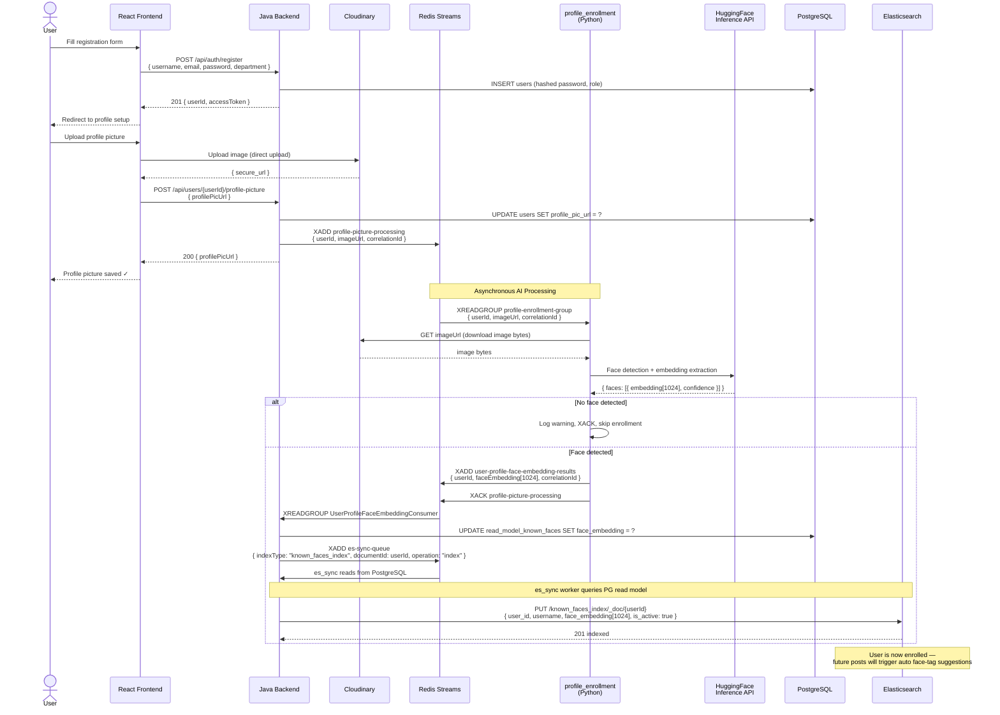
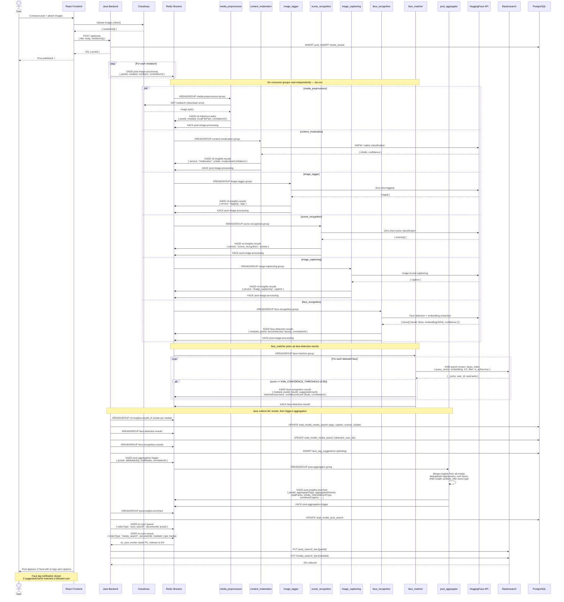
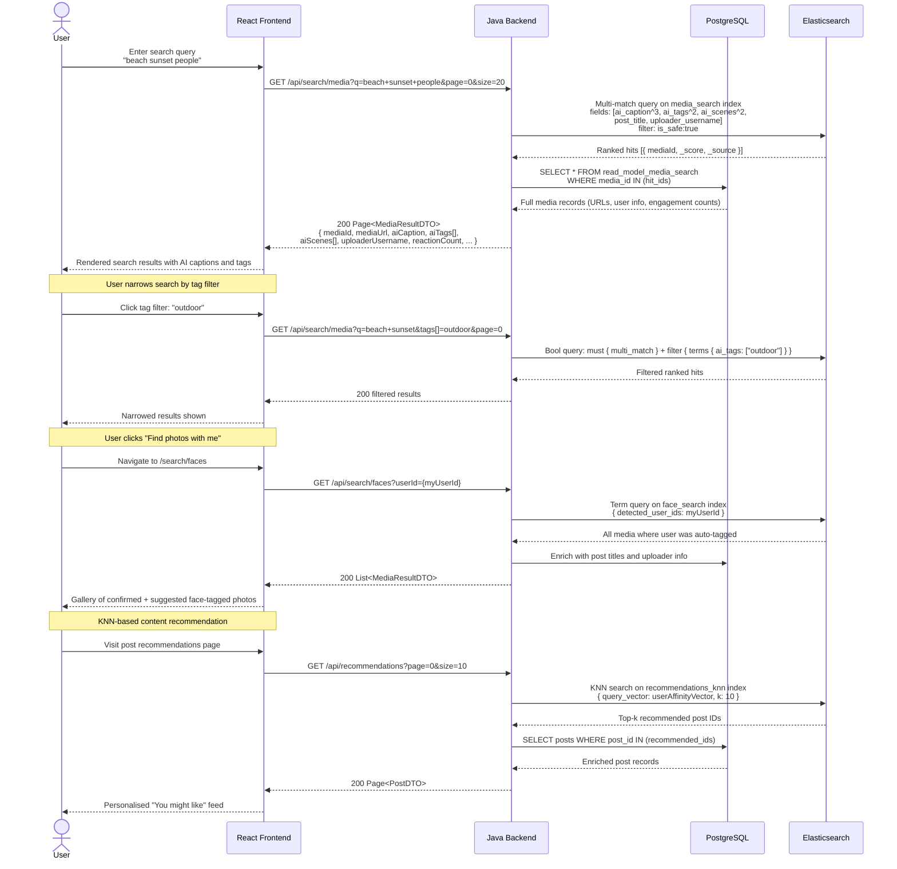

# User Journeys — Kaleidoscope Platform

> **Edition:** Phase C (April 2026)  
> **Scope:** End-to-end flows through the full stack — React → Java → Redis → Python → Elasticsearch.

---

## Table of Contents

1. [Journey 1: User Registration & Profile Picture Enrollment](#1-journey-1-user-registration--profile-picture-enrollment)
2. [Journey 2: Post Creation & Auto-Tagging](#2-journey-2-post-creation--auto-tagging)
3. [Journey 3: Media Discovery & Semantic Search](#3-journey-3-media-discovery--semantic-search)

---

## 1. Journey 1: User Registration & Profile Picture Enrollment

### Overview

A new user creates an account and uploads a profile picture. The platform extracts a face embedding from the picture and enrolls it into the `known_faces_index` in Elasticsearch, enabling future automatic face-tag suggestions on posts.

### Sequence Diagram



### Key Events

| Step | Stream / API | Producer | Consumer |
|------|-------------|----------|---------|
| Register | `POST /api/auth/register` | React | Java |
| Upload picture | `POST /api/users/{id}/profile-picture` | React | Java |
| Trigger enrollment | `profile-picture-processing` | Java | `profile_enrollment` |
| Return embedding | `user-profile-face-embedding-results` | `profile_enrollment` | Java |
| Trigger ES sync | `es-sync-queue` | Java | `es_sync` |
| Index enrollment | ES `known_faces_index` | `es_sync` | Elasticsearch |

### Failure Modes

- **No face in picture:** `profile_enrollment` logs a warning and ACKs the message without publishing to `user-profile-face-embedding-results`. The user's profile is saved without a face embedding; they can re-upload at any time.
- **HuggingFace timeout:** `profile_enrollment` publishes to `ai-processing-dlq`. `dlq_processor` retries up to `DLQ_MAX_RETRIES` times.
- **Cloudinary unreachable:** `validate_url()` rejects private/loopback IPs via SSRF check before any download attempt.

---

## 2. Journey 2: Post Creation & Auto-Tagging

### Overview

A user creates a post with one or more images. The Java backend fans out AI processing jobs to six concurrent Python workers. After all ML results are collected, a `post_aggregator` merges the insights. The `face_matcher` runs KNN search against enrolled profiles and emits face-tag suggestions back to Java. The complete enriched post is then indexed into Elasticsearch.

### Sequence Diagram



### Key Events

| Step | Stream | Producer | Consumer |
|------|--------|----------|---------|
| Trigger ML pipeline | `post-image-processing` | Java | 6 Python workers (fan-out) |
| Pre-fetch image | `ml-inference-tasks` | `media_preprocessor` | *(pending TD-1)* |
| ML results | `ml-insights-results` | 4 ML workers | Java |
| Face embeddings | `face-detection-results` | `face_recognition` | `face_matcher` + Java |
| Face-tag suggestions | `face-recognition-results` | `face_matcher` | Java |
| Aggregate insights | `post-aggregation-trigger` | Java | `post_aggregator` |
| Enriched post | `post-insights-enriched` | `post_aggregator` | Java |
| Index to ES | `es-sync-queue` | Java | `es_sync` |

### KNN Threshold

`face_matcher` uses `KNN_CONFIDENCE_THRESHOLD` (default `0.85`). Only faces exceeding this cosine similarity score against `known_faces_index` generate a `face-recognition-results` event. Java creates a **pending** tag suggestion requiring user confirmation.

---

## 3. Journey 3: Media Discovery & Semantic Search

### Overview

A user searches for media using a keyword query. The Java backend queries Elasticsearch against the `media_search` index (enriched with AI-generated captions, tags, and scene classifications written during Journey 2) and returns ranked, AI-enhanced results.

### Sequence Diagram



### Elasticsearch Query Patterns

| Search Type | Index | Query Strategy | Key Boosting |
|------------|-------|---------------|-------------|
| Full-text media search | `media_search` | `multi_match` + `is_safe: true` filter | `ai_caption` ×3, `ai_tags` ×2, `ai_scenes` ×2 |
| Tag-filtered search | `media_search` | Bool `must` + `terms` filter on `ai_tags` | — |
| Post-level search | `post_search` | `multi_match` on title, caption, tags | `inferred_event_type` match |
| User discovery | `user_search` | `multi_match` on username, department | — |
| Face search | `face_search` | `term` on `detected_user_ids` | — |
| Face KNN | `known_faces_index` | `knn` on `face_embedding` (cosine, 1024-dim) | `is_active: true` filter |
| Recommendations | `recommendations_knn` | `knn` on `content_embedding` | User affinity vector |

### Data Flow That Enables Search

All search results are powered by AI enrichment written during Journey 2. The chain is:

```
Post uploaded  
  → post-image-processing  
    → [content_moderation, image_tagger, scene_recognition, image_captioning, face_recognition]  
      → ml-insights-results + face-detection-results  
        → post_aggregator → post-insights-enriched  
          → es-sync-queue  
            → es_sync (reads PostgreSQL read model, writes to Elasticsearch)  
              → media_search / post_search indices  
                → Search API responds with AI-enhanced results
```

The typical end-to-end latency from upload to searchability is **15–45 seconds** under normal load, bounded by HuggingFace inference round-trips.
